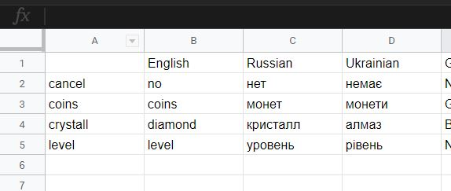
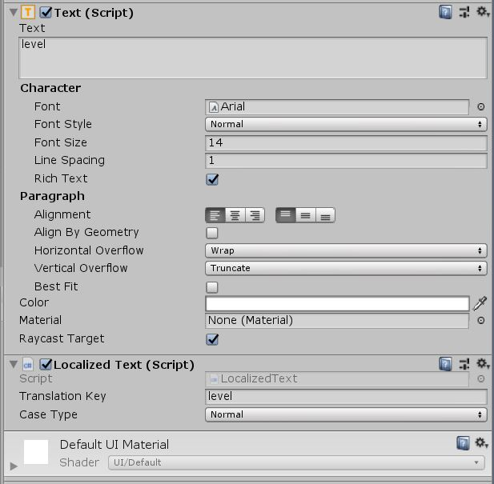
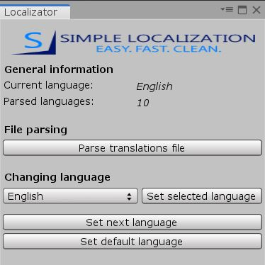
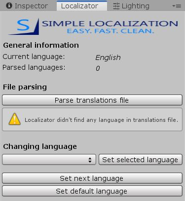

# SimpleLocalization
Plugin for localizing the Text component in Unity. It uses a TSV file with keys and translated texts in different languages. Has a convenient edtior window for work with localization (change language, parsing file, testing).

[](https://github.com/RodionLodza/simplelocalization/blob/master/LICENSE)
[](https://github.com/RodionLodza/simplelocalization/watchers)
[](https://github.com/RodionLodza/simplelocalization/stargazers)
<br />
<< [Pipeline](#what-is-the-work-pipeline-with-the-localizator) | [Advantages](#why-use-this-plugin) | [Install](#how-to-install) | [Download](https://github.com/RodionLodza/simplelocalization/raw/master/SimpleLocalization.unitypackage) >>
<br />
<br />

## What is the work pipeline with the localizator?
1. Create a TSV file with translations. A TSV file can be created using [Google Tables](https://www.google.ru/intl/ru/sheets/about/). It’s quite a convenient thing for both game designers and developers.


<br />
<br />

2. You must rename the TSV file to `Translations.txt` and place it in the project resources folder: `Assets/Resourses`. 
> ***Why .txt?*** Because plugin uses Unity TextAsset class for parsing the file, which requires the .txt format.
> ***Why TextAsset?*** After the tests of different methods of reading the file, the TextAsset class showed fast speed.
<br />
<br />

3. Use all translated texts inside the game. Texts can be translated either dynamically using the `Localizator.Translate` method, or by adding the `LocalizedText` component to the required Text component. You can also customize certain styles of writing text.

```c#
using Tools.Localizator;
using UnityEngine.UI;
using UnityEngine;

public class DynamicText : MonoBehaviour
{
    [SerializeField] private Text someText;

    private void Start()
    {
        someText.text = Localizator.Translate("coin");
    }
}
```

<br />
<br />

4. Test translations. You can test translations both with the unity editor (**using the Tools -> Localizator editor window**) and with the test buttons on the phone (use the `Localizator.ChangeLanguage()` method).


<br />
<br />

5. Correct errors (if they are of course). In case of unsuccessful reading of the file, its absence and similar problems, an error will be displayed in the localizer editor window + a similar message will be displayed in the console.


<br />
<br />

## Why use this plugin?
1. Very simple. You can figure it out in a couple of minutes - the best thing for indie developers.
2. High performance. In the process of writing the plugin, a variety of input file options were used (XML, JSON, etc.). TSV turned out to be the most effective with much less weight (almost 2 times less than the above) and a high read speed of the file.
3. Convenient pipeline work. The work pipeline offered by this plugin is quite convenient for indie developers.
<br />
<br />

## How to install?
Download `SimpleLocalization.unitypackage` and using UnityPackageManager.
<br />
<br />

## License
* [MIT](https://github.com/RodionLodza/simplelocalization/blob/master/LICENSE)
