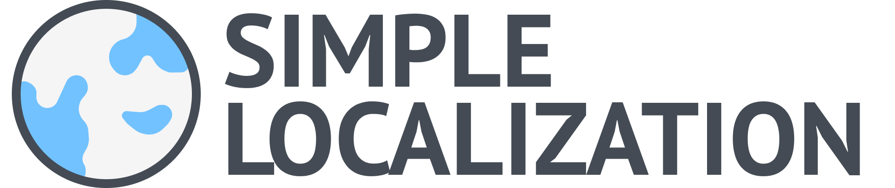
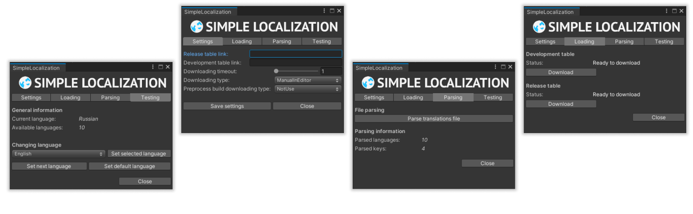

# SimpleLocalization
Plugin for localizing Unity projects using Google Tables. It can translate Text components, TextMeshPro, and receive localized strings in custom scripts. Has flexible customization.

 

## Features
1. Automatic translation of Text, TextMeshPro components
2. Runtime change language without restarting the application
3. Using different Google Tables for development and release versions
4. Ability to customize the download of translations (auto, manual)
5. Ability to download translations before building the project
6. Functionality for quick testing of translations
7. Validation of translations

## How to use?
On the [project homepage](https://github.com/RodionLodza/SimpleLocalization/wiki) you can find information about SimpleLocalization:  documentation, getting-started guides and downloading.
 

## License
* [MIT](https://github.com/RodionLodza/simplelocalization/blob/master/LICENSE)
